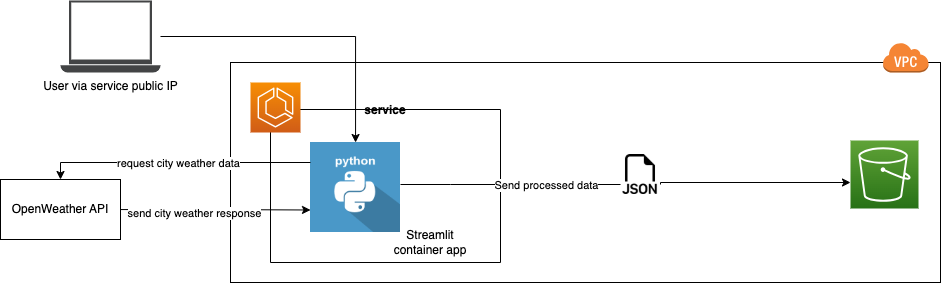

# Weather Dashboard

## About
A Streamlit app that fetches and displays real-time weather data for cities.

## Stack
- Python
- Boto3
- Streamlit (open-source Python library for web apps)
- AWS S3
- AWS ECS/Fargate (deploy)
- GitHub Actions

## Architectural Diagram

## Features
- Fetches real-time weather data for any specified city of choice
- Displays weather conditions like temperature (°F), humidity, etc
- Automatically saves weather data to AWS S3 with timestamps for historical tracking

## Concepts Learnt
- Python web app development (using Streamlit)
- Infrastructure as Code (using SDKs)
- Cloud Storage (AWS S3)
- Containerisation (Docker)
- Container App Deployment (AWS ECS with Fargate)
- CI/CD (GitHub Actions)

## Development Process
  - [Documentation](docs.md)
  - [Blog post](https://khairahscorner.hashnode.dev/build-and-deploy-weather-app-using-streamlit-and-aws-ecs-with-fargate)

## Enhancements
- Use Application Load balancer to route internet traffic to the app in the cluster (instead of public-facing IP addresses) for scalability and security
- Use a public-private-subnets architecture and use an API Gateway as the entry point, routing requests to the load balancer.

[Enhancement project](https://github.com/khairahscorner/scalable-containerised-api)