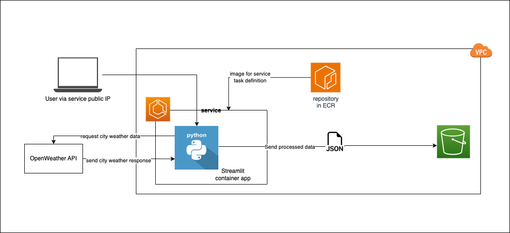

# Weather Dashboard

## About
A Streamlit app that fetches and displays real-time weather data for cities.

## Stack
- Python
- Boto3
- Streamlit (open-source Python library for web apps)
- AWS S3
- GitHub Actions
- AWS ECS/Fargate (deploy)

## Architectural Diagram

## Features
- Fetches real-time weather data for any specified city of choice
- Displays weather conditions like temperature (°F), humidity, etc
- Automatically saves weather data to AWS S3 with timestamps for historical tracking

## Concepts Learnt
- Python web app development (using Streamlit)
- Infrastructure as Code (using SDKs)
- Cloud Storage (AWS S3)
- Containerisation (Docker)
- Container App Deployment (AWS ECS with Fargate)
- CI/CD (GitHub Actions, AWS)

## Development Process
  - [Documentation](docs.md)
  - TBA: Blog post

## CI/CD
TBC